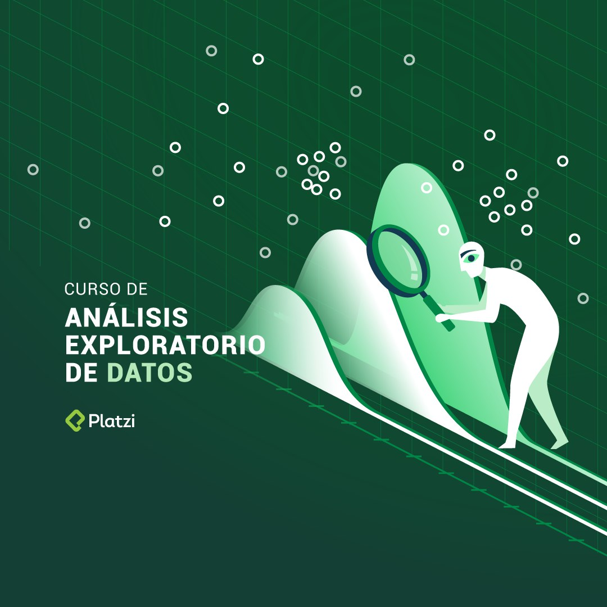

Your career in data science requires understanding the nature of data
and its distribution and exploring it using statistical analysis or
visualization tools. Through an EDA, you can propose the most
appropriate model to address the questions of your projects.

In this course you will learn:

-   Quantify the relationship that exists between the variables of the
    data set.

-   Visualize the distribution of data and observe their relationships
    through graphs.

-   Describe the general behavior of your data using measures of central
    tendency and measures of dispersion.

-   Know different tools to carry out complete exploratory analyses.
