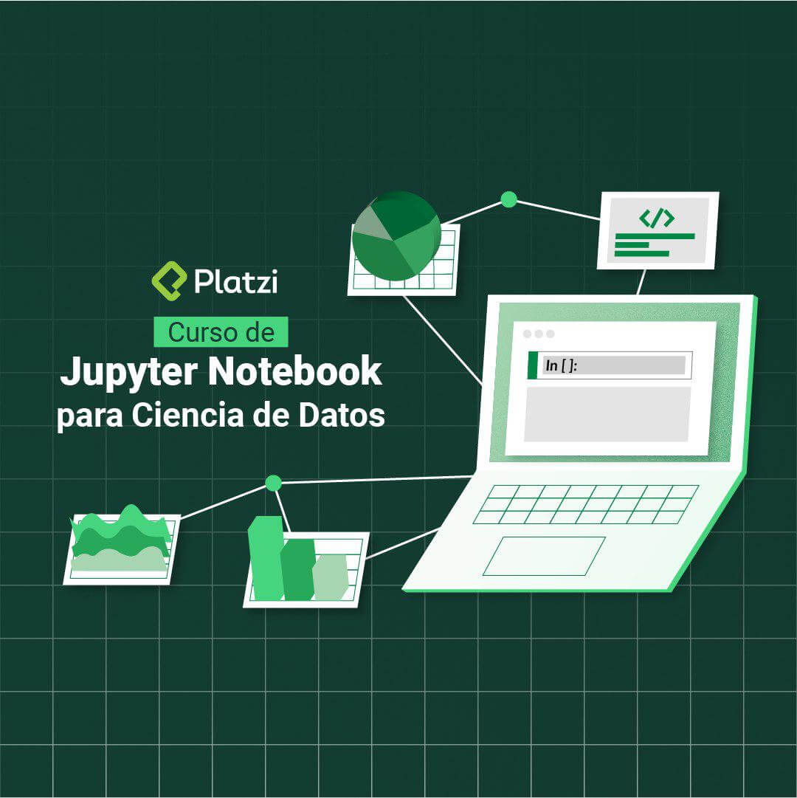

In this course you will learn:

-   Different programming environments for Data Science.
-   How to use [Google Colab](https://colab.research.google.com/).
-   How to use [Deepnote](https://deepnote.com/).
-   How to use and configure [VSCode](https://code.visualstudio.com/).
-   How to use [Conda
    environments](https://www.anaconda.com/products/distribution) for
    Data Science.
