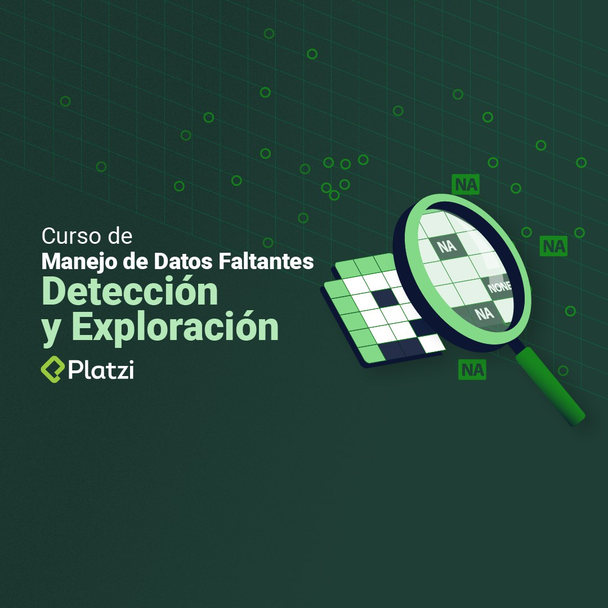

In data science, you will always encounter incomplete
datasets you must deal with. This course teaches you
how to address missing values and find relationships
between them. Execute the best treatment to your data
with missing values, eliminating or imputing them.

- Find relationships between missing values.
- Understands methods for dealing with missing values.
- Encodes, converts and manipulates missing values of various types.
- Tabulate and visualize missing values in your data.
