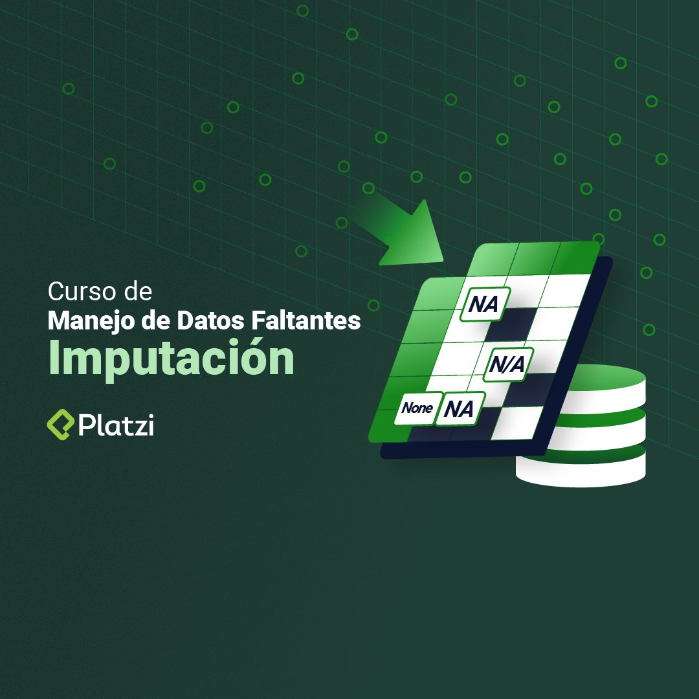

By detecting and exploring missing values in datasets,
you can enrich them through data imputation. In this way,
you can run analyses with better information. This course
teaches you how to treat variables and run the appropriate 
imputation method for your data set.

- Use model-based imputation methods such as KNN and MICE.
- Implement donor-based imputation methods.
- Prepare categorical variables for imputation.
