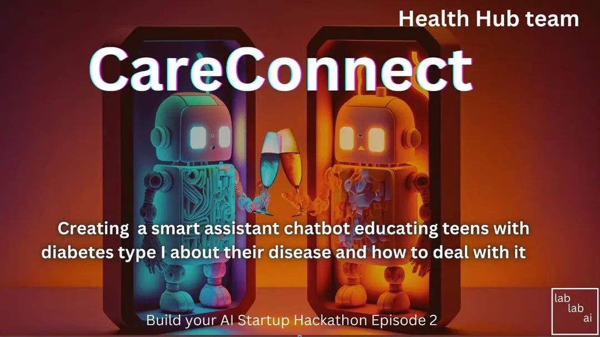

Our team is developing a chatbot named CareBot, which aims to provide aftercare solutions to patients and establish a seamless connection between doctors and patients.

Our goal is to offer 24/7 personalized solutions to patients by leveraging the power of chatbot technology. CareBot will enable doctors to provide professional documentation that is customized to each patient's unique needs, enabling patients to receive tailored advice and guidance related to their condition, medication, and treatment plan.
 
Additionally, CareBot will analyze patients' behavior and provide valuable feedback to doctors regarding their conversations with patients, allowing them to better understand patients' needs and concerns.

We believe that CareBot will be a game-changer in the healthcare industry, helping patients to manage their health conditions more effectively while facilitating communication between patients and healthcare providers.
