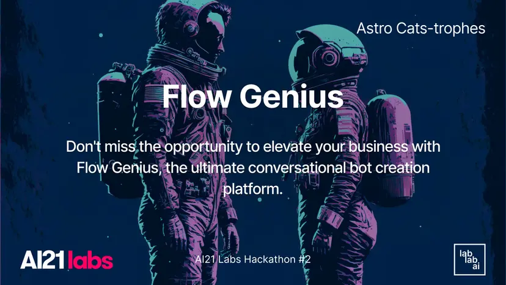

Flow Genius is an intuitive and user-friendly conversational bot creation platform designed to help businesses of all sizes build powerful chatbots without coding or technical knowledge. With Flow Genius, users can easily create custom chatbots that can handle customer queries, process transactions, and perform various other functions.

The platform features a drag-and-drop interface, pre-built templates, and a variety of integrations with popular messaging platforms and business tools. Flow Genius is designed to be simple and easy to use, even for users without technical knowledge or coding experience. The platform's drag-and-drop interface and pre-built templates make creating custom chatbots that can handle a wide range of customer queries and tasks quick and easy.

With Flow Genius, businesses can create chatbots that perform various functions, from handling customer queries and processing transactions to scheduling appointments, sending notifications, and more. This versatility makes the platform a valuable tool for businesses of all sizes and industries.

Flow Genius integrates with popular messaging platforms and business tools, including Facebook Messenger, Slack, and Zapier. This makes it easy for businesses to connect with their customers on their preferred platforms and automate their workflows across multiple tools

Flow Genius provides users with detailed analytics and reporting tools to help them track their bot's performance, optimize their conversational strategies, and improve their customer engagement over time. This data-driven approach can help businesses save time, increase efficiency, and boost customer satisfaction.