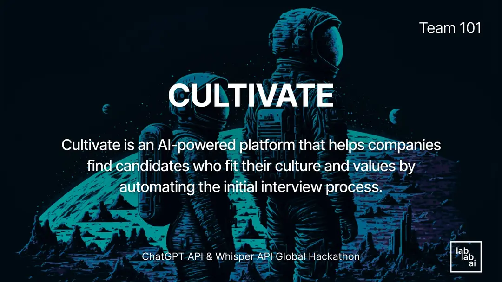

Investing in the right talent is crucial to the success of any company, but finding candidates who are skilled and fit well with the organization's culture can be daunting. We have the solution. Our cultural fit bot, Cultivate, leverages the power of AI to help companies identify candidates who align with their culture, work style, and values.

By automating the initial interview process, Cultivate enables recruiters to evaluate more candidates and make data-driven hiring decisions without compromising the quality of the hire. With Cultivate, recruiters and hiring managers can analyze candidates' responses to real-world scenarios and identify critical thinking, problem-solving, and communication skills.

blo The bot also provides instant feedback on candidates' cultural fit, including their attitudes, beliefs, and behavioral patterns. It enables recruiters to identify top candidates that align with their company culture and values.
 
Our platform continues beyond there. Cultivate also provides: An automatic interview summary for each candidate. Highlighting their strengths and weaknesses. A set of metrics that help recruiters make informed hiring decisions based on data, not opinions. These features significantly reduce the risk of bias in the hiring process, promoting fairness and inclusion. 

Investing in Cultivate means investing in the future of your company. By leveraging the power of AI to streamline the hiring process, we help you find top talent that not only meets the job requirements but also aligns with your company culture and values, ultimately improving productivity, employee engagement, and retention rates. Join us today and start growing your team with harmony and success.
