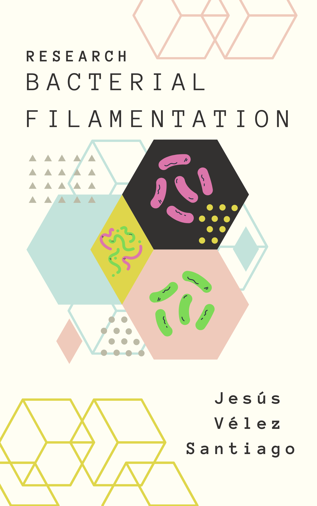

## Abstract

Scientists have extensively studied the mechanisms that orchestrate the
growth and division of bacterial cells. Cells adapt their shape and
dimensions in response to variations in the intracellular and
extracellular environments by integrating information about the presence
of nutrients or harmful agents in the decision to grow or
divide. *Filamentation* is a process that occurs when rod-shaped cells
stop dividing but continue to grow, thus producing elongated cells
([Wang et al.
2014](https://jvelezmagic.github.io/bacterial-filamentation-research/99-references.html#ref-Wang2014);
[Wang, Yin, and Chen
2014](https://jvelezmagic.github.io/bacterial-filamentation-research/99-references.html#ref-Wang2014a);
[Jaimes-Lizcano, Hunn, and Papadopoulos
2014](https://jvelezmagic.github.io/bacterial-filamentation-research/99-references.html#ref-jaimes-lizcano2014);
[Sheryl S. Justice et al.
2008](https://jvelezmagic.github.io/bacterial-filamentation-research/99-references.html#ref-justiceMorphologicalPlasticityBacterial2008)).
Some cells can naturally grow as filamentous, while others only do so
under stressful conditions ([Cayron, Dedieu, and Lesterlin
2020](https://jvelezmagic.github.io/bacterial-filamentation-research/99-references.html#ref-cayron2020);
[S. S. Justice et al.
2006](https://jvelezmagic.github.io/bacterial-filamentation-research/99-references.html#ref-justiceFilamentationEscherichiaColi2006)).
Here, we use mathematical modeling and computational simulations to
evaluate a toxic agent\'s intracellular concentration as a function of
cell length. We show that filamentation can act as a strategy that
promotes the resilience of a bacterial population under stressful
environmental conditions.
